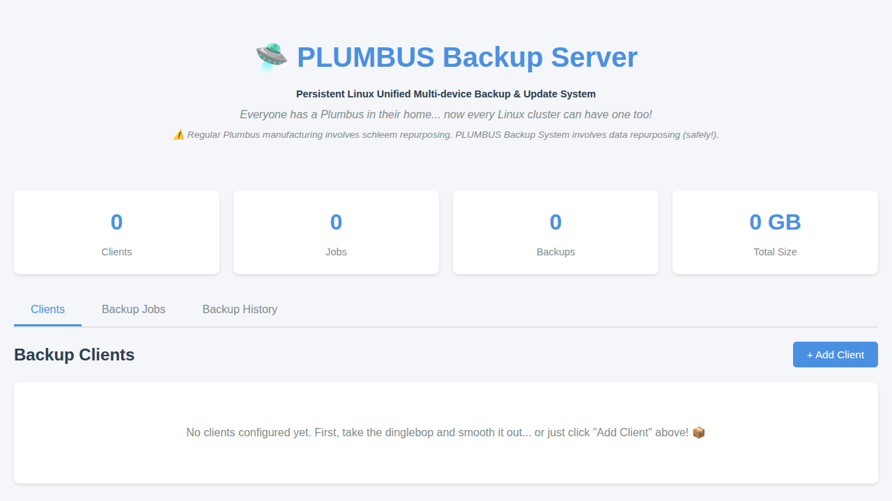
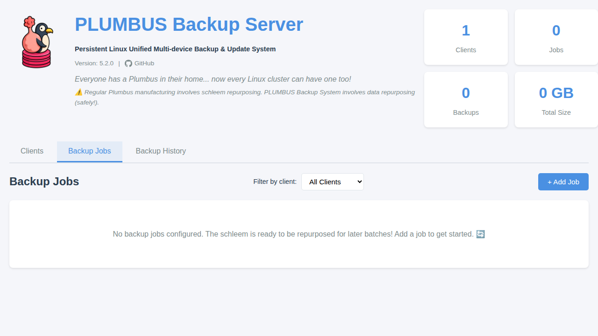
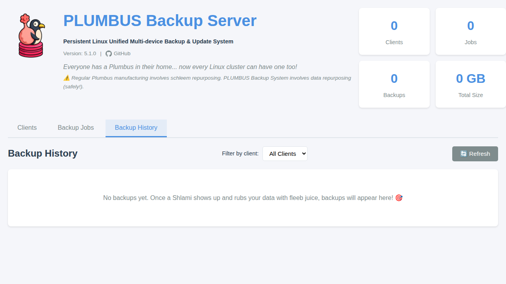

# PLUMBUS
## Persistent Linux Unified Multi-device Backup & Update System


*Everyone has a Plumbus in their home... now every Linux cluster can have one too!*

Nobody really knows how Plumbus works, but it keeps your data safe through a carefully refined process involving schleem, fleeb juice, and just the right amount of quantum entanglement. The dinglebop is then smoothed out with a bunch of schleem (which is repurposed for later backups).

## What is PLUMBUS?

PLUMBUS is a centralized backup solution for Raspberry Pi, Linux servers, and other devices across different VLANs. It runs as a Docker container and provides a beautiful web interface for managing your backups.

### Features

- 🚀 **Multi-Architecture Support**: Works on ARM64 and x86-64 systems
- 🌐 **Web Interface**: Beautiful, modern UI for managing clients, jobs, and backups
- 🔄 **Automated Backups**: Schedule backups using cron expressions
- 📁 **File Browser**: Browse remote filesystems to select backup paths
- 🔐 **SSH/Rsync Based**: Agent-less backups using standard SSH
- 🏠 **VLAN-Friendly**: Works across different network segments
- 📊 **Backup Statistics**: Real-time dashboard with backup sizes, success rates, and history
- ↻ **Restore Capability**: Easy restoration of backed-up files
- 🔑 **Flexible Authentication**: Supports both password and SSH key-based authentication
- 🛡️ **Sudo Support**: Optional sudo for backing up system files requiring elevated permissions

## Screenshots

### Main Dashboard

*The main dashboard showing backup statistics and navigation tabs*

### Add Client Modal

*Easy-to-use interface for adding backup clients with SSH authentication*

### Backup Jobs

*Manage and schedule backup jobs for your clients*

### Backup History

*View and restore from backup history*

### How PLUMBUS is Made

Regular old Plumbus manufacturing:
1. First they take the dinglebop and smooth it out with a bunch of schleem
2. The schleem is then repurposed for later batches
3. They take the dinglebop and push it through the grumbo
4. A Shlami shows up and rubs it with fleeb juice

PLUMBUS Backup System manufacturing:
1. First, you deploy the Docker container (the dinglebop)
2. Configure your backup clients (smoothing with schleem)
3. Set up backup jobs (pushing through the grumbo)
4. Watch as backups run automatically (the Shlami does its job)
5. Your data is safe! (Everyone has a Plumbus!)

## Quick Start

### Pull from GitHub Container Registry

```bash
# For multi-arch (automatically selects the right architecture)
docker pull ghcr.io/loryanstrant/plumbus:latest

# Or use docker-compose
docker-compose up -d
```

### Using Docker Compose

```bash
# Clone the repository
git clone https://github.com/loryanstrant/plumbus.git
cd plumbus

# Start the container
docker-compose up -d

# Access the web interface
open http://localhost:5000
```

### Manual Docker Run

```bash
docker run -d \
  -p 5000:5000 \
  -v plumbus-data:/data \
  --name plumbus-backup \
  ghcr.io/loryanstrant/plumbus:latest
```

## Configuration

### Adding a Client

1. Open the web interface at `http://your-server:5000`
2. Click "Add Client" 
3. Enter your Raspberry Pi or Linux server details:
   - Name (e.g., "Raspberry Pi Zero 2 W")
   - Host (IP address or hostname)
   - SSH credentials (password or key-based authentication)
4. Test the connection to ensure it works

### Creating a Backup Job

1. Go to the "Backup Jobs" tab
2. Click "Add Job"
3. Select your client
4. Use the file browser to select what to backup
5. Set a schedule (or leave empty for manual backups)
6. Enable the job

### Scheduling Format

Use cron expressions for scheduling:
- `0 2 * * *` - Daily at 2 AM
- `0 0 * * 0` - Weekly on Sunday at midnight
- `0 */6 * * *` - Every 6 hours
- `*/30 * * * *` - Every 30 minutes

## Architecture Support

PLUMBUS supports the following architectures:
- `linux/amd64` (x86 64-bit) - Most modern PCs and servers
- `linux/arm64` (ARM 64-bit) - Raspberry Pi 3/4/5/Zero 2 W and other ARM64 devices

The Docker image automatically detects and uses the correct architecture for your system.

## Requirements

### Backup Server (where PLUMBUS runs)
- Docker and Docker Compose
- Persistent storage for backups
- Network access to backup clients

### Backup Clients (what you're backing up)
- SSH server running
- rsync installed
- Network connectivity to backup server

## API Documentation

PLUMBUS provides a REST API for automation:

**Clients:**
- `GET /api/clients` - List all clients
- `POST /api/clients` - Add a new client
- `GET /api/clients/{id}` - Get client details
- `PUT /api/clients/{id}` - Update a client
- `DELETE /api/clients/{id}` - Delete a client
- `POST /api/clients/{id}/test` - Test SSH connection to client
- `POST /api/clients/{id}/browse` - Browse files on client

**Backup Jobs:**
- `GET /api/jobs` - List all backup jobs
- `POST /api/jobs` - Create a backup job
- `GET /api/jobs/{id}` - Get job details
- `PUT /api/jobs/{id}` - Update a job
- `DELETE /api/jobs/{id}` - Delete a job
- `POST /api/jobs/{id}/run` - Run a job immediately
- `GET /api/jobs/{id}/history` - Get backup history for a job

**Backups:**
- `GET /api/backups` - List all backups
- `GET /api/backups/{id}` - Get backup details
- `GET /api/backups/{id}/files` - List files in a backup
- `POST /api/backups/{id}/restore` - Restore a backup

**System:**
- `GET /api/stats` - Get backup statistics
- `GET /api/version` - Get application version

## Development

```bash
# Install dependencies
pip install -r requirements.txt

# Run in development mode
python app.py

# Build Docker image locally
docker build -t plumbus .
```

## Troubleshooting

**Q: Why doesn't my backup work?**
A: Just like a regular Plumbus, sometimes you need to smooth out the dinglebop. Check:
- SSH connectivity to your client
- Sufficient disk space on the backup server
- Correct source path on the client

**Q: I'm getting "Permission denied" errors when backing up system files**
A: If you need to backup files that require elevated permissions (like `/etc/nut/` or other system directories), enable the "Use sudo" option for the client. This will run `sudo rsync` on the remote server. 

**Requirements:**
- The remote user must have sudo privileges
- Configure passwordless sudo for rsync on the remote server:
  ```bash
  # Add these lines to /etc/sudoers (use visudo)
  # Allow rsync to run without a TTY (required for SSH-based automation)
  Defaults!/usr/bin/rsync !requiretty
  
  # Allow specific user to run rsync with sudo without password
  # Replace 'username' with the actual username
  username ALL=(ALL) NOPASSWD: /usr/bin/rsync
  ```

**Important:** PLUMBUS will now automatically verify that the user has passwordless sudo access to rsync when you:
- Test a connection with "Use sudo" enabled
- Run a backup job with "Use sudo" enabled
- Restore a backup with "Use sudo" enabled

If sudo access is not properly configured, you will receive a clear error message with instructions on how to fix it.
  
**Security Note:** This configuration allows the user to read any file on the system using rsync. Only grant this privilege to trusted users and consider restricting to specific paths if your sudo version supports it.

**Q: Can I backup across VLANs?**
A: Yes! As long as the backup server can reach your clients via SSH (port 22 by default).

**Q: Does this support Windows?**
A: PLUMBUS is designed for Linux systems. Windows support would require significant schleem repurposing.

## Security Considerations

⚠️ **Important Security Notes:**

- **Password Storage**: Passwords are stored in the database. For production use, ensure the database file is properly secured with filesystem permissions.
- **SSH Keys Recommended**: For better security, use SSH key-based authentication instead of passwords.
- **Host Key Verification**: SSH host keys are automatically accepted. In production environments, consider manually verifying host keys first.
- **Network Security**: Ensure PLUMBUS is deployed in a trusted network environment or behind proper authentication/authorization.
- **Docker Security**: Run the container with appropriate user permissions and resource limits.

**Best Practices:**
1. Use SSH key-based authentication for all clients
2. Secure the `/data` volume with appropriate permissions
3. Use firewall rules to restrict access to PLUMBUS web interface
4. Regularly update the Docker image to get security patches
5. Back up your PLUMBUS database regularly
6. When using sudo for backups, limit sudo privileges to only rsync using NOPASSWD configuration

## Contributing

Everyone knows about Plumbus, but contributions are always welcome! 
Please submit pull requests or open issues on GitHub.

## License

MIT License - See LICENSE file for details

## Acknowledgments

- Inspired by the mysterious Plumbus from Rick and Morty
- Built with Flask, Paramiko, and rsync
- Powered by fleeb juice and quantum entanglement
